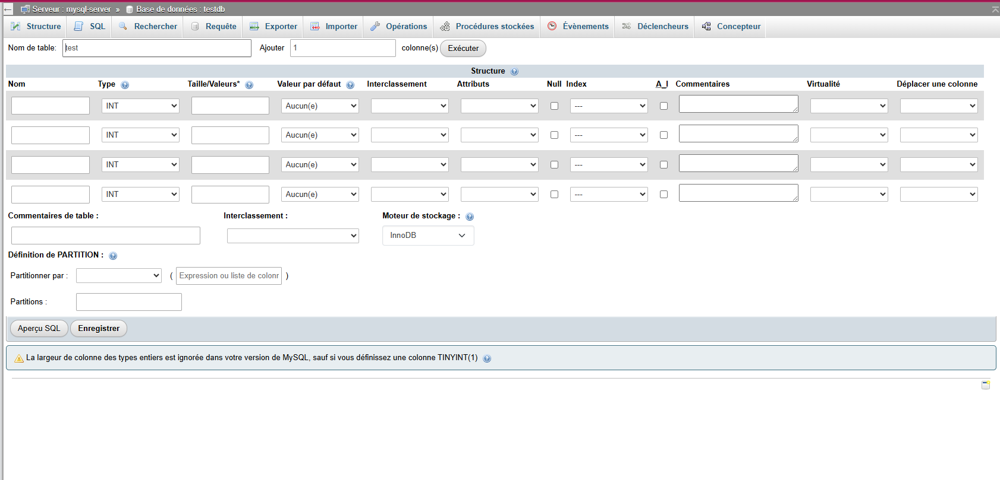

# Rapport Docker – TP : Images, Containers, Réseaux, Dockerfile et Docker Compose

## 1. Installation de Docker

Docker est déjà installé.

---

## 2. Vérification de l'installation

Effectué avec succès.

---

## 3. Création d'une image nginx avec contenu personnalisé

### a. Récupération de l'image nginx

```bash
$ git branch image_nginx
$ git checkout image_nginx
$ docker pull nginx
$ git add .
$ git commit -m "Étape 3.a : Récupération de l'image nginx depuis Docker Hub"
$ git push origin image_nginx
```

### b. Vérification de l’image

```bash
$ docker images

REPOSITORY   TAG       IMAGE ID       CREATED        SIZE  
nginx        latest    fb39280b7b9e   6 weeks ago    279MB
```

### c. Création du fichier HTML

```bash
$ mkdir -p html
$ echo "Hello World" > html/index.html
$ git add html/index.html
$ git commit -m "Étape 3.c : Création du fichier index.html"
```

### d. Lancement du container avec **volume monté**

```bash
$ docker run -d -p 8080:80 -v $(pwd)/html:/usr/share/nginx/html --name webserver nginx
$ git commit --allow-empty -m "Étape 3.d : Lancement du container avec montage du fichier HTML"
```

### e. Suppression du container

```bash
$ docker stop webserver
$ docker rm webserver
$ git commit --allow-empty -m "Étape 3.e : Suppression du container"
```

### f. Lancement du container sans volume, avec `docker cp`

```bash
$ docker run -d -p 8080:80 --name webserver2 nginx
$ docker cp html/index.html webserver2:/usr/share/nginx/html/index.html
$ git commit --allow-empty -m "Étape 3.f : Relance du container sans volume, utilisation de docker cp"
```

---

## 4. Création d’une image personnalisée avec Dockerfile

### a. Rédaction du Dockerfile

```Dockerfile
FROM nginx:latest
COPY ./html/index.html /usr/share/nginx/html/index.html
```

```bash
$ git add Dockerfile
$ git commit -m "Étape 4.a : Ajout du Dockerfile pour builder une image nginx personnalisée"
```

### b. Build et lancement du container

```bash
$ docker build -t custom-nginx .
$ docker run -d -p 8080:80 --name custom-server custom-nginx
```

---

## 4. c. Comparaison des méthodes : volume monté VS COPY

### Méthode 1 – Volume monté (`-v`)

**Avantages :**

* Modifications visibles en temps réel sans rebuild.
* Très pratique pour le développement rapide.

**Inconvénients :**

* Le fichier n’est pas dans l’image, donc l’image n’est pas autonome.
* Moins fiable pour des environnements de production.

### Méthode 2 – `COPY` dans Dockerfile

**Avantages :**

* L’image contient tout : autonome et portable.
* Idéal pour la production, CI/CD, et les déploiements.

**Inconvénients :**

* Rebuild nécessaire à chaque modification du fichier.
* Moins pratique pour un développement itératif.

| Critère                  | Volume monté (`-v`) | `COPY` dans Dockerfile      |
| ------------------------ | ------------------- | --------------------------- |
| Modifications à chaud    | Oui                 | Non                         |
| Image autonome           | Non                 | Oui                         |
| Rapidité de dev          | Très rapide         | Plus lent (build à refaire) |
| Pertinence en production | Non recommandée     | Recommandée                 |

---

## 5. Utilisation d'une base de données avec Docker

### a. Récupération des images

```bash
$ docker pull mysql
$ docker pull phpmyadmin/phpmyadmin
$ git commit --allow-empty -m "Étape 5.a : Pull des images mysql et phpmyadmin depuis Docker Hub"
```

### b. Création d'un réseau

```bash
$ docker network create mynet
$ git commit --allow-empty -m "Étape 5.b : Création du réseau Docker mynet"
```

### c. Lancement des containers MySQL + phpMyAdmin

#### MySQL :

```bash
$ docker run -d \
  --name mysql-server \
  --network mynet \
  -e MYSQL_ROOT_PASSWORD=rootpass \
  -e MYSQL_DATABASE=testdb \
  -e MYSQL_USER=testuser \
  -e MYSQL_PASSWORD=testpass \
  mysql
```

#### phpMyAdmin :

```bash
$ docker run -d \
  --name myadmin \
  --network mynet \
  -e PMA_HOST=mysql-server \
  -p 8081:80 \
  phpmyadmin/phpmyadmin
$ git commit --allow-empty -m "Étape 5.c : Lancement de MySQL et phpMyAdmin avec réseau Docker"
```
> Interface accessible sur `http://localhost:8081`



---

## 6. Utilisation de `docker-compose`

### a. Différence entre `docker run` et `docker-compose`

* `docker run` : lance un seul container manuellement, ligne par ligne.
* `docker-compose` : permet de définir plusieurs services (containers, volumes, réseaux) dans un fichier `docker-compose.yml`. Très utile pour les environnements multi-conteneurs.

### b. Commandes principales

* **Lancement des services** :

  ```bash
  $ docker-compose up -d
  ```
* **Arrêt et suppression des services** :

  ```bash
  $ docker-compose down
  ```

### c. Exemple de `docker-compose.yml`

```yaml
version: "3.8"

services:
  mysql:
    image: mysql:latest
    container_name: mysql-server
    environment:
      MYSQL_ROOT_PASSWORD: rootpass
      MYSQL_DATABASE: testdb
      MYSQL_USER: testuser
      MYSQL_PASSWORD: testpass
    networks:
      - mynet

  phpmyadmin:
    image: phpmyadmin/phpmyadmin
    container_name: myadmin
    environment:
      PMA_HOST: mysql-server
    ports:
      - "8081:80"
    networks:
      - mynet

networks:
  mynet:
```

```bash
$ git add docker-compose.yml
$ git commit -m "Étape 6.c : Ajout de docker-compose pour mysql + phpmyadmin"
```